# JudicialAI-BE — Complete Project Flow

> Every box below maps to **an actual file and function** in the codebase.  
> Arrows show **who calls whom** at runtime.  
> AI models (LLMs, Embeddings) and Vector DBs are explicitly highlighted.

---

## 1. Application Startup

When the server starts (`uvicorn main:app`), the `startup()` event in [main.py](file:///Users/nsppasinnovations/Desktop/NS%20APPS%20PROJECTS/judicialAI-BE/main.py#L391-L403) loads all three FAISS indexes into memory so they are ready for queries.

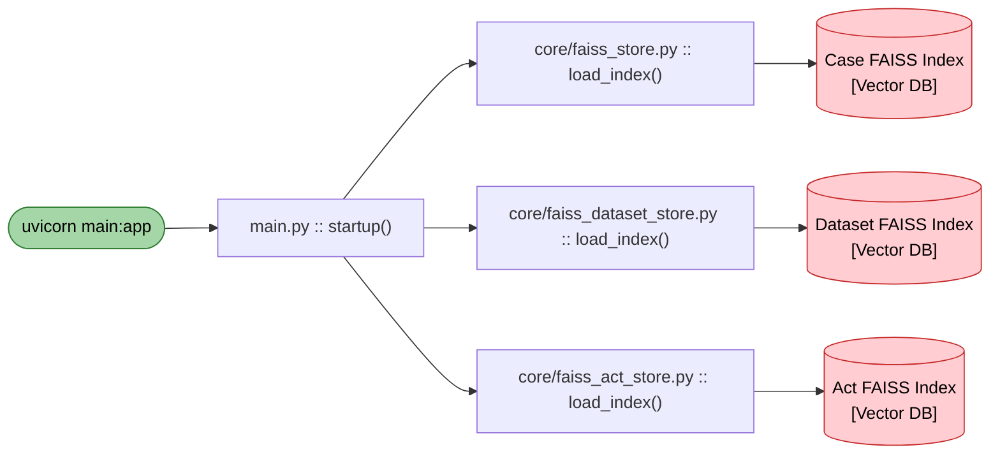

---

## 2. Router & Module Map

All routes are registered in [main.py](file:///Users/nsppasinnovations/Desktop/NS%20APPS%20PROJECTS/judicialAI-BE/main.py). Two sub-routers are also mounted:

```mermaid
flowchart TD
    APP["main.py\n(FastAPI app)"]

    APP -->|"include_router"| R1["legal_extraction/router.py\n/extract, /embed"]
    APP -->|"include_router"| R2["routers/thread_router.py\n/judicialAI/threads/*"]

    APP --> E1["POST /judicialAI-caseAnalysis/start"]
    APP --> E1b["GET  /judicialAI-caseAnalysis/status/:id"]
    APP --> E2["POST /judicialAI/find-findings"]
    APP --> E3["POST /judicialAI-judgmentDraft/generate"]
    APP --> E3b["GET  /judicialAI-judgmentDraft/status/:id"]
    APP --> E4["POST /judicialAI/precedent-retrieval"]
    APP --> E4b["GET  /judicialAI/precedent-retrieval/:id"]
    APP --> E5["POST /judicialAI-act/search"]
    APP --> E6["POST /judicialAI-previousOrder/extract"]
    APP --> E7["POST /judicialAI-appellant/extract"]
    APP --> E8["POST /judicialAI-respondent/extract"]

    style APP fill:#bbdefb,stroke:#1565c0,color:#000
    style R1 fill:#c8e6c9,stroke:#2e7d32,color:#000
    style R2 fill:#c8e6c9,stroke:#2e7d32,color:#000
```

---

## 3. Flow A — Case Analysis (Facts + Conflicts)

**Endpoint:** `POST /judicialAI-caseAnalysis/start`

This is an **async job**. The endpoint returns a `job_id` immediately and runs the analysis in a background thread. Uses the LLM twice (once for facts, once for conflicts).

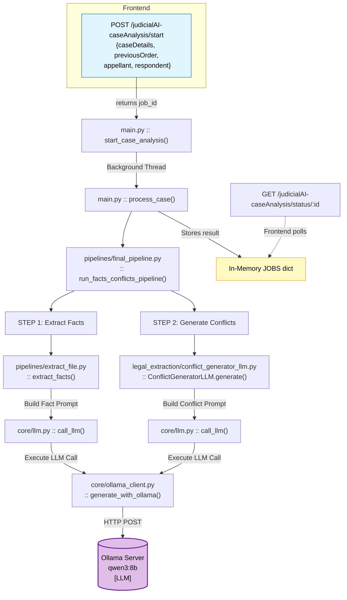

> [!NOTE]
> `extract_facts()` here is from [pipelines/extract_file.py](file:///Users/nsppasinnovations/Desktop/NS%20APPS%20PROJECTS/judicialAI-BE/pipelines/extract_file.py) (v2 — direct LLM call). No FAISS is used in this path.

---

## 4. Flow B — Find Findings

**Endpoint:** `POST /judicialAI/find-findings`

Takes the facts + conflicts from Flow A and generates structured judicial findings. Uses the LLM in strict JSON mode.

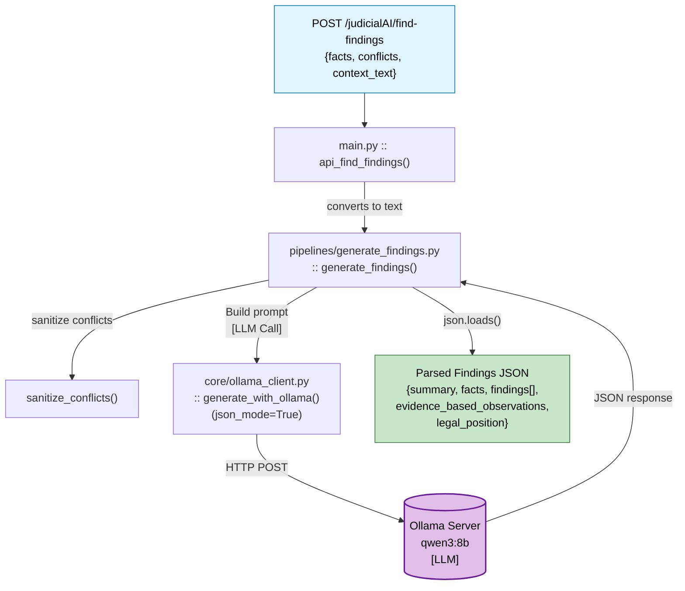

---

## 5. Flow C — Judgment Draft Generation

**Endpoint:** `POST /judicialAI-judgmentDraft/generate`

Another **async job**. Takes facts, conflicts, findings, verdict, case details, and optional precedent/act text, and feeds it all into the LLM.

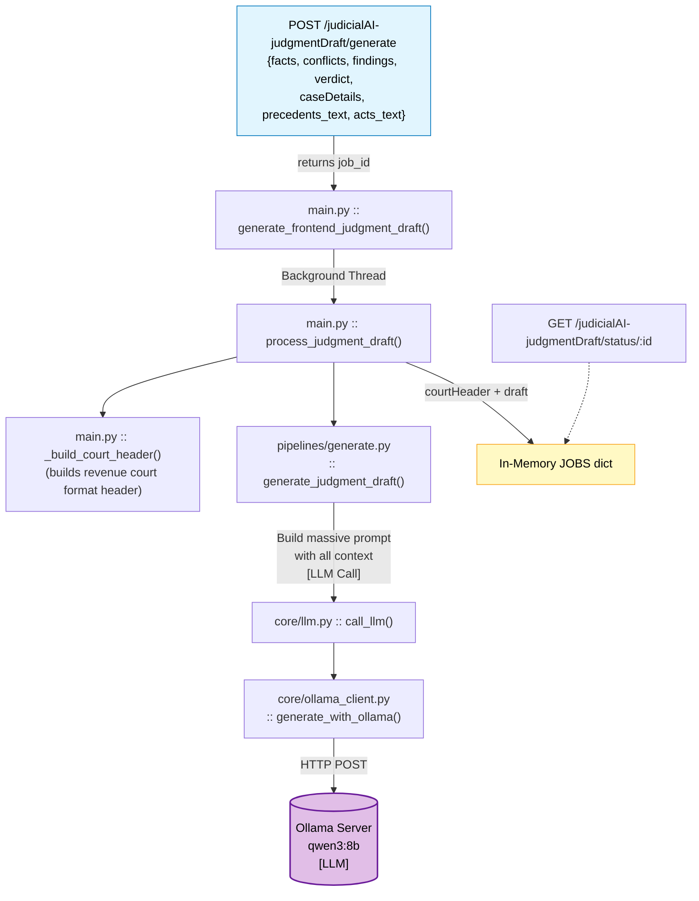

---

## 6. Flow D — Precedent Retrieval

**Endpoint:** `POST /judicialAI/precedent-retrieval`

Another **async job**. Highly complex path: embeds query, searches 2 Vector DBs, then uses the LLM to analyze *each* retrieved precedent.

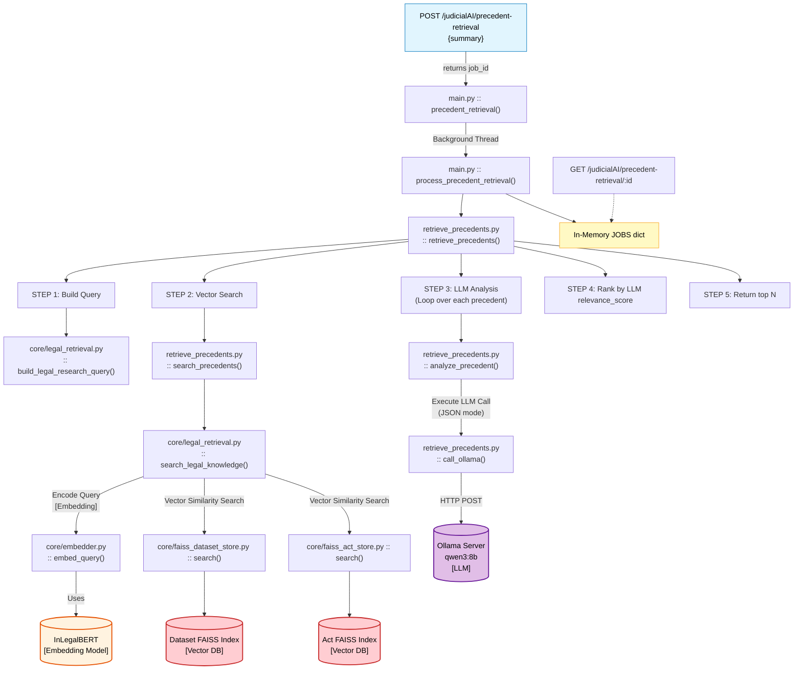

---

## 7. Flow E — Act Search

**Endpoint:** `POST /judicialAI-act/search`

A **synchronous** endpoint. Embeds query, searches Acts FAISS index. No LLM used here.

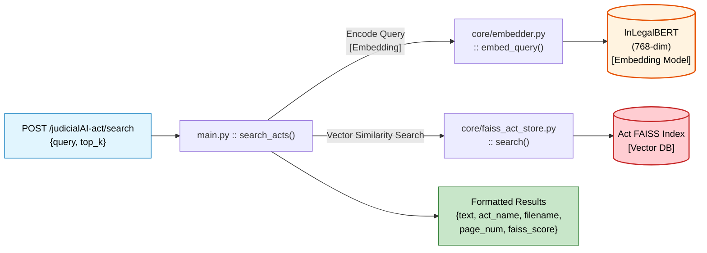

---

## 8. Flow F — Structured Legal Extraction

**Endpoint:** `POST /extract` (via [legal_extraction/router.py](file:///Users/nsppasinnovations/Desktop/NS%20APPS%20PROJECTS/judicialAI-BE/legal_extraction/router.py))

Uses the LLM extensively to extract JSON from raw PDFs.

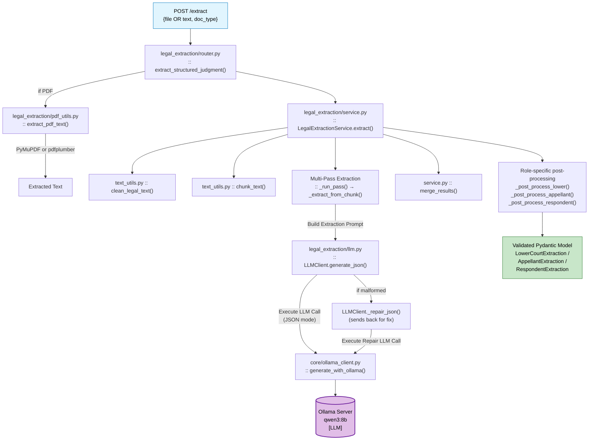

**Embedding endpoint:** `POST /embed`

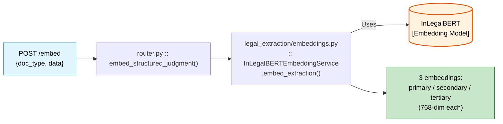

---

## 9. Thread History (Save/Load)

**Endpoints:** `POST/GET/DELETE /judicialAI/threads/*`

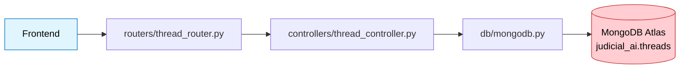

| Endpoint | Action |
|---|---|
| `POST /judicialAI/threads/save` | Save or update a thread (upsert by `thread_id`) |
| `GET /judicialAI/threads/` | List recent threads (sidebar history) |
| `GET /judicialAI/threads/:id` | Load a specific thread |
| `DELETE /judicialAI/threads/:id` | Delete a thread |

---

## 10. Document Text Intake (Simple Normalization)

These three endpoints just validate and normalize text. **No AI or FAISS is involved.**

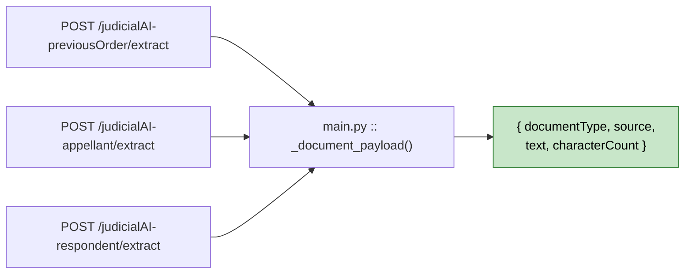

---

## 11. Offline Ingestion (Dataset & Acts)

These are run **manually** from the command line, not from API endpoints. Embeds PDFs and inserts vectors into FAISS.

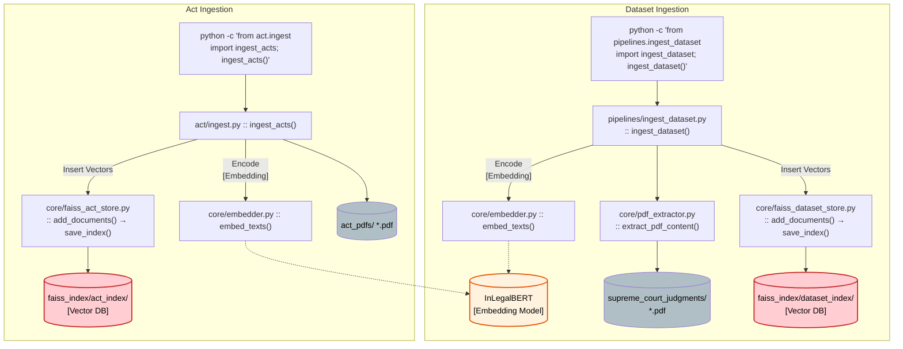

---

## 12. Core Module Dependency Map

This shows how the **core/** modules wrap the external AI/DB services.

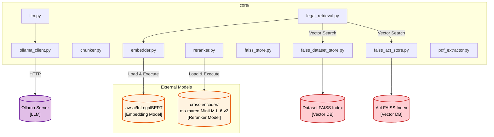

---

## 13. Full End-to-End User Journey

This is the complete flow a user follows through the frontend, annotated with AI model usage.

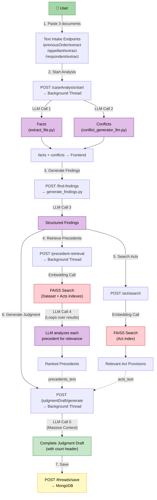
